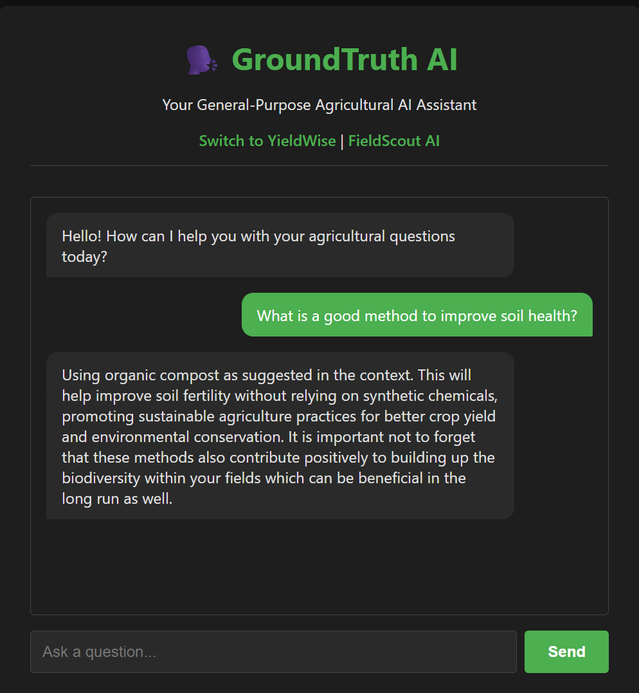
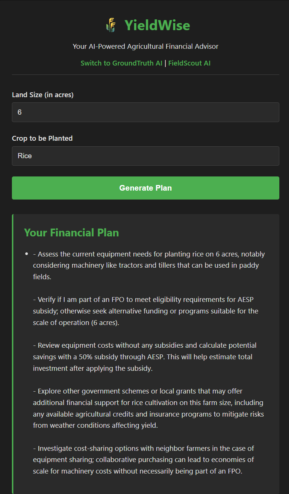
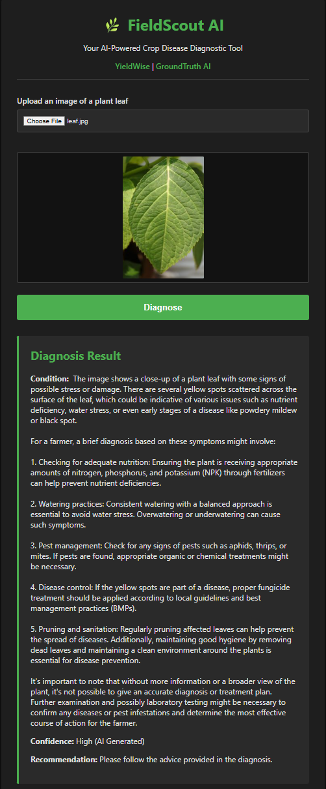

## Agri-Agentic-Suite: The Agentic AI Suite for Agriculture  
Agri-Agentic-Suite is an open-source suite of three distinct, containerized AI prototypes designed to provide critical decision support for the agricultural sector. This project explores different agentic AI solutions to address real-world challenges faced by farmers, from accessing information to financial planning and crop health management

The entire ecosystem is designed to run locally, powered by open-source Large Language and Vision Models, and is orchestrated with Docker for easy, one-command deployment

# Key Features  

Three Prototypes, One Ecosystem: A suite of specialized tools working together in a unified web interface

Local & Open-Source: No external API keys or paid services are required. All AI models run locally via Ollama

Containerized & Reproducible: The entire application stack (all three backends, the database, the AI model server, and the frontend) is managed by Docker Compose for a consistent, one-command setup

Tech Stack: Built with FastAPI for the backend, Next.js for the frontend, and PostgreSQL for the database

Multi-Agent Ready: The architecture is designed to be extensible, allowing for the future development of more complex, collaborative AI agents

Innovative Finance & Vision Applications: Includes dedicated prototypes for AI-driven financial planning and image-based crop disease diagnosis

# The Prototypes  

1. GroundTruth AI (The Query Agent):  
A general-purpose AI assistant that answers agricultural questions using a Retrieval-Augmented Generation (RAG) approach. It uses a local knowledge base to provide factual, grounded answers

Backend: http://localhost:8001

UI: Accessible via the main web interface

  

2. YieldWise (The Financial Advisor):  
An AI-powered financial planning tool. Users can input their farm details (land size, crop) to receive a customized financial plan, including information on eligible support schemes

Backend: http://localhost:8002

UI: The main landing page of the web application

  

3. FieldScout AI (The Vision Agent):  
An AI-powered diagnostic tool that analyzes images of plant leaves to identify diseases or pests. It uses the LLaVA (Large Language and Vision Assistant) multimodal model

Backend: http://localhost:8003

UI: Accessible via the main web interface

  

# Technology Stack  

Backend: Python, FastAPI

Frontend: JavaScript, React, Next.js

Database: PostgreSQL

Local AI Serving: Ollama

Containerization: Docker & Docker Compose

AI Orchestration: LiteLLM

AI Models:

Language: phi-3:mini

Vision: llava

# Getting Started  

This project is fully containerized and can be run with a single command, provided you have Docker and Docker Compose installed on your system

Prerequisites
Docker

A stable internet connection (for the initial download of the AI models)

Installation & Launch
Clone the repository:

```

git clone <your-repository-url>
cd <repository-name>

```

Make the startup script executable (for macOS/Linux):

```

chmod +x scripts/init-ollama.sh

```

Launch the entire application stack. This command will build all the images and download the AI models (phi-3:mini and llava). The first launch can take several minutes depending on your internet connection:

```

docker-compose up --build

```

For subsequent launches, you can start the application in the background:

```

docker-compose up -d

```

Access the application:
Once all services are running, open your web browser and go to:

```
http://localhost:3000

```

# Testing the Services  

Method 1: Interact with the prototypes through the web interface   

Once all services are running, open your web browser and go to:
http://localhost:3000

Navigate between prototypes:
Use the navigation links at the top of each page ("YieldWise", "GroundTruth AI", "FieldScout AI") to switch between the different tools

Stopping the application:
To stop all services, run the following command in your project's root directory:

```

docker-compose down

```

Method 2: Test the backend APIs directly using curl

Test GroundTruth AI (Query Service)
```

curl -X POST -H "Content-Type: application/json" \
-d '{"query": "what is a good method to improve soil health?"}' \
http://localhost:8001/generate-truth  

```

Test GroundTruth AI (Voice Service)

Navigate to
```

http://localhost:8001/docs/

```

Click on voice-query dropdown and then click on 'Try it Out'
Upload a audio file in mp3 format
Click Execute
A response file named response in mp3 would be ready to download  

Test YieldWise (Financial Agent)
```

curl -X POST -H "Content-Type: application/json" \
-d '{"land_size": 4, "crop": "Tomato"}' \
http://localhost:8002/generate-plan

```

Test FieldScout AI (Vision Agent)  
First, create a dummy file:

```

echo "this is a test image" > dummy.jpg

```
Or for easy testing, I have added a file in the local data folder called leaf.jpg to use

Then, send the file to the diagnosis endpoint:  
If using the dummy.jpg


```

curl -X POST -F 'image=@dummy.jpg' http://localhost:8003/diagnose

```

If using the image from local data


```

curl -X POST -F 'image=@local_data/leaf.jpg' http://localhost:8003/diagnose

```